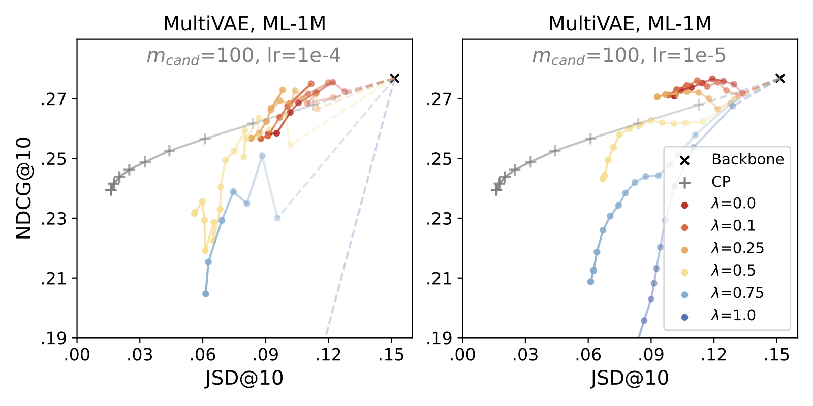
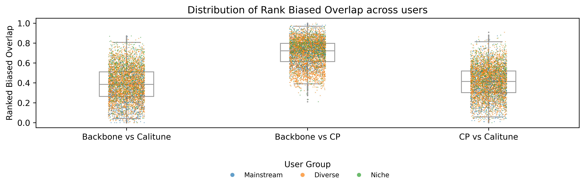
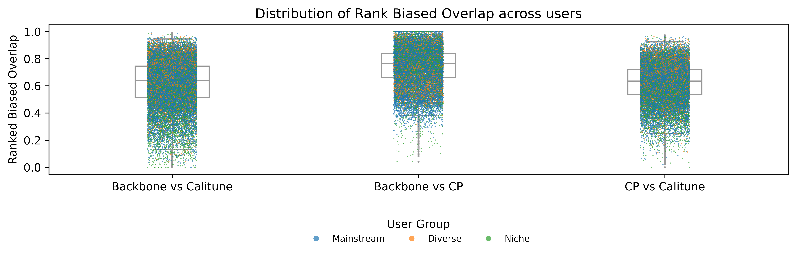
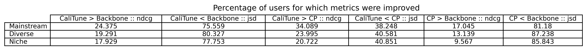
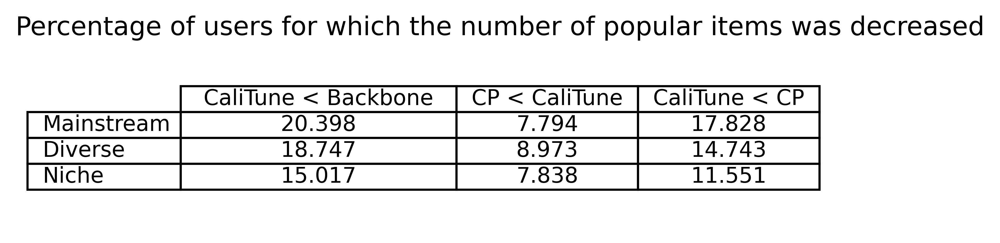
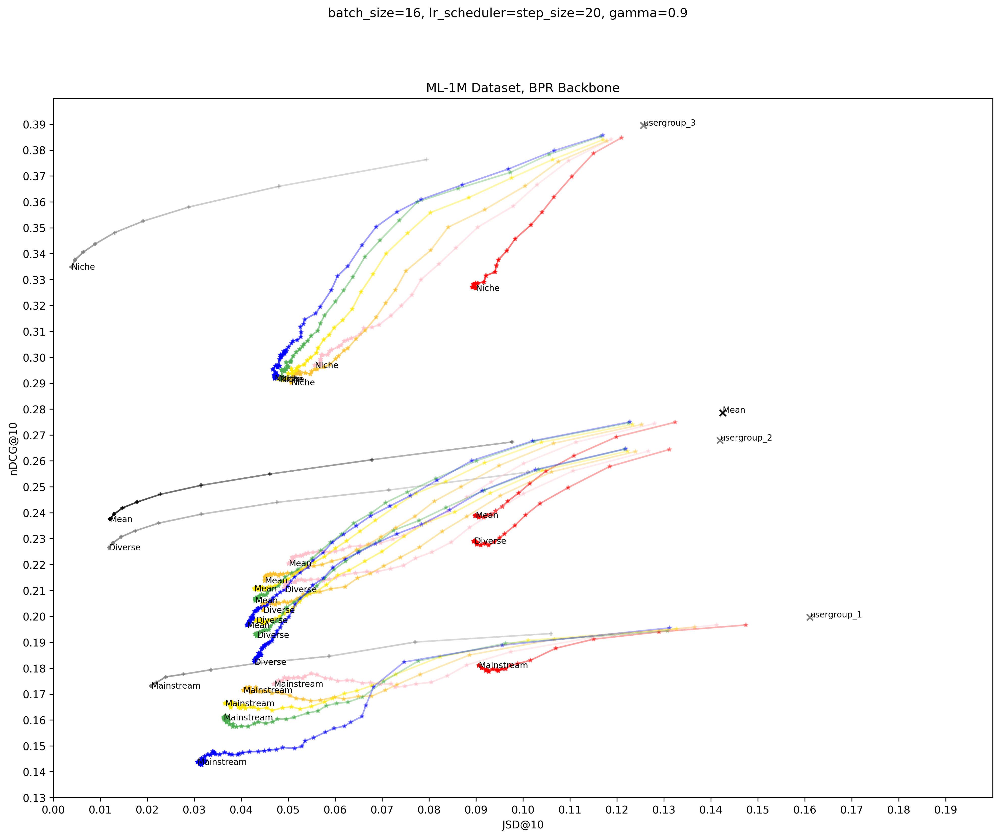
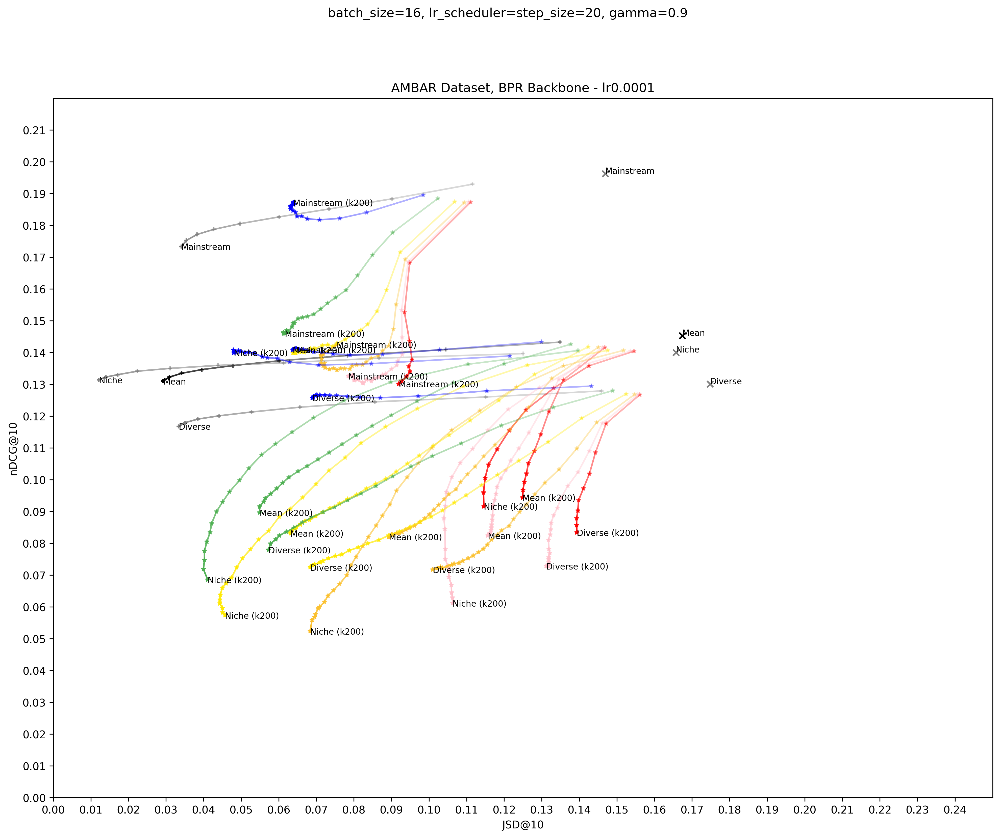
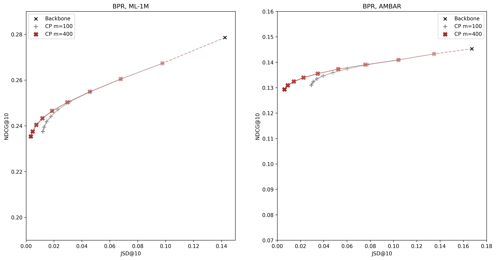

# CaliTune
Companion repository for the paper: "Fine-tuning for Inference-efficient Calibrated Recommendations" by  
*Oleg Lesota*, *Adrian Bajko*, *Max Walder*, *Matthias Wenzel*, *Antonela Tommasel*, and *Markus Schedl*

accepted for the LBR track at RecSys 2025

Contents:
- [Additional results](#additional-results)
- [Supplementary materials](#supplementary-materials)
- [Running fine-tuning (quick start)](#quickstart)

## Additional results
### Compatibility with modern architectures (MultiVAE on ML-1M, preliminary)
Native accuracy loss of MultiVAE is used within the CaliTune framework instead of 'LA_u'.

### Differences in recommendation lists (configurations from Fig.3)
We compared CaliTune and CP to the backbone model (BPR) using Rank-biased Overlap. For each run, we compared CaliTune’s final epoch to the CP configuration with the closest JSD value (for a fair trade-off comparison). CP generally preserved the backbone model's rankings, while CaliTune introduced more substantial changes.
#### ML-1M

#### AMBAR

### Metric improvement over the population (configurations from Fig.3)
#### ML-1M

#### AMBAR

### Changes in recommendation of popular items over the population (configurations from Fig.3)
In MovieLens, CaliTune reduced the number of popular items for nearly twice as many users as CP among Diverse and Niche users. Similar trends were seen in AMBAR. At the user level, CaliTune improved NDCG for 21–24% and JSD for up to 87% of users on MovieLens over the backbone, and 17–24% and up to 80% on AMBAR, highlighting its ability to support user preferences without sacrificing accuracy. 
#### ML-1M

#### AMBAR

## Supplementary materials
This section provides an overview of supplementary materials available in the repository.
The code used to generate the figures in the paper can be found in the Jupyter notebooks prefixed `submission-`.
The remaining figures shown are generated through the remaining notebooks.

### Grid search on each Backbone & Dataset

For visualization of the full grid search, we point towards the following four notebooks:
- `grid-search-bpr-ml-1m.ipynb`
- `grid-search-bpr-ambar.ipynb`
- `grid-search-dmf-ml-1m.ipynb`
- `grid-search-dmf-ambar.ipynb`

Additionally, initial experiments for ML-100K and a sample from `LFM-2B` dataset can be found in the following notebooks:
- `grid-search-bpr-ml-100k.ipynb`
- `grid-search-bpr-lfm-sample.ipynb`

### Experimenatal data
The results of all conducted experiments can be found in the `metrics` folder.

### Additional plots
#### Performance per user group:

#### Post-processing with `m=400` vs `m=100`:
Following previous work, we executed all our post-processing experiments used in the submission with `m=100`. The following plot shows
the difference between this setting and a higher (computationally more expensive) `m=400`:

## Quickstart
The quickstart guide here follows all steps from start to finish on getting metrics out of CaliTune applied to BPR on ML-100k dataset.

Check out the `--help` options on each commands to customize for different datasets, models and hyperparameters.

### Installation
Install all the dependencies in `requirements.txt`. Make sure to use the correct package index to grab a CUDA capable
version of Pytorch.

### 1. Train a backbone model
As a first step, you'll need to train a backbone model. This is the model that will be used to extract the initial weights
for the postprocessing and finetuning experiments

`python3 run_recbole.py`

### 2. Rename the base model to something easier
Recbole outputs its model in a file that has the current date and time in its name. We need this file for various purposes,
thus it makes sense to save it under a more convenient name.

For this quickstart guide we will rename the file to `ml-100k-256.pth`:

`mv saved/BPR-<...> saved/ml-100k-256.pth`

### 3. Call preparation Script
This script will compute and save all additional information needed for the finetuning process.

`python3 prepare_for_calibration.py`

The new files are saved next to the data in `data/ml-100k/` as well as `splits` and include:

- `base_weights.pth; ml-100k.itememb; ml-100k.useremb`: Extracted model weights from the Recbole Backbone model
- `splits/ml-100k/<train|valid|test>_split.tsv`: Extracted train/valid/test ID splits in order to retain the same train/valid/test splits as the original recbole model training
- `ml-100k.popularity`: Item Popularity bins: One-Hot encoding of the popularity class of each item
- `ml-100k.userbaseline`: User Popularity target baselines: Target percentages for each user and popularity class

### 4. Use multi_experiment.py or grid_search.py
Both helper scripts are the most convenient way to fully automate the process of running multiple finetuning experiments
and to obtain the metrics for each of them.

Both scripts do the following in a loop:

- Run finetuning (through `calitune.py`)
- copy necessary data into `evaluation/<dataset>/<experiment_name>` folder
- Run evaluation code (`evaluation/run_and_evaluate.py`) to obtain metrics for base model, CP post-processing and CaliTune
  - note that for performance reasons postprocessing is only called for the first experiment in the loop
- move resulting metric files into `metrics/<dataset>/<experiment_name>.json` and per-user metrics into `per_user_metrics/<dataset>/<experiment_name>/per_user_metrics.tsv.zip`

Check out the source code both scripts to see how they work. Adjust Dataset, Base model and configuration files
and then execute either depending on your needs:

`python3 multi_experiment.py`
or
`python3 grid_search.py`

#### multi_experiment.py
This script uses a (currently hardcoded) list of tuples `(experiment_name, config_path)` to execute
multiple experiments after each other and then write the metrics to the corresponding files in
`metrics/<dataset>/experiment_name.json`

#### grid_search.py
Similarily to multi_experiment.py, multiple experiments are executed and evaluated after each other.
Here, a grid search across a parameter space is conducted. Change the (currently hardcoded) sets of hyperparameters 
to match your desired search space.

### 5. Interpret results
After doing the previous steps, one or multiple metrics files should have been created in
`metrics/ml-100k/`. These files contain for the backbone model, CP post-processing and CaliTune:

- mean NDCG@10 and JSD@10
- mean NDCG@10 and JSD@10 per user-group (split 20/60/20 according to their HighPop percentage)
- per-user NDCG@10 and JSD@10 (in `per_user_metrics` file)
